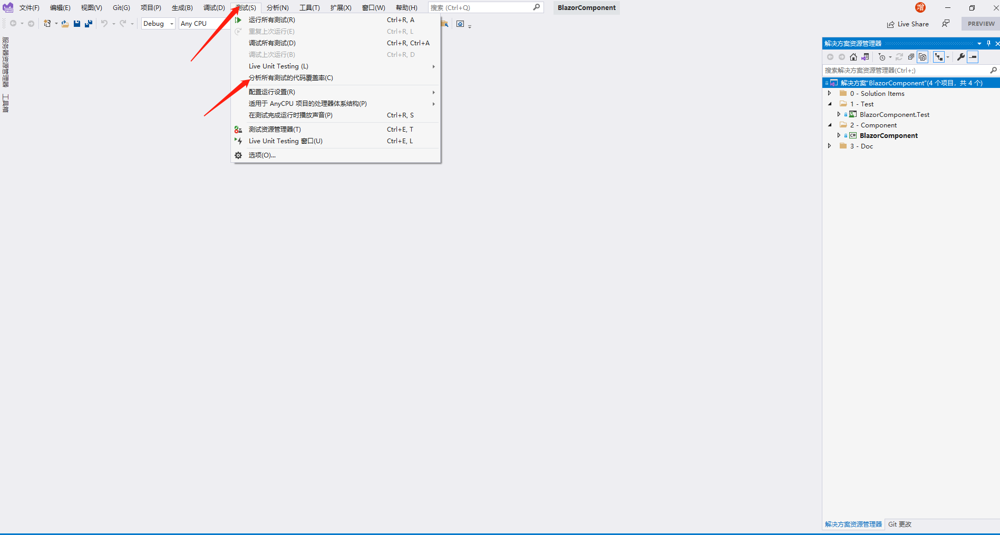

# README.md

## 1、什么是单元测试？

​	测试分为单元测试和集成测试。单元测试主要对单个类的公有属性和方法进行测试，不会涉及依赖对象，所有依赖对象都会用mock对象或者桩对象代替。因此，单元测试的主要目的是测试单个类的工作是否正常。集成测试则不然，需要测试在各个不同的使用场景中，各个类是否协调一致并且工作正常。

## 2、为什么要进行单元测试？

​	单元测试可以保证代码的正确性和稳定性。在测试驱动开发中，测试是先行的。单元测试会给出代码用例，程序的编写必须符合代码用例。在开发过程中，我们难免会对代码进行更改，如果改出了bug，单元测试可以第一时间发现问题。单元测试还可以测出边界情况，程序正常运行时很少涉及边界值，单元测试能够增强程序的健壮性。所以，单元测试是十分重要的。

## 3、如何对BlazorComponent进行单元测试？

### 2.1 前期准备

​	BlazorComponent是一个无样式的抽象组件库，需要对其模版和功能进行测试。

​	开发工具：

- [.NET 6 Preview 7](https://dotnet.microsoft.com/download/dotnet/6.0)
- [vs2022](https://visualstudio.microsoft.com/zh-hans/vs/preview/) 

### 2.2 项目结构

```
BlazorComponent
├── ...
├── src
│   ├── Test
│	│   └── BlazorComponent.Test 测试项目
│   ├── Component
│	│   └── BlazorComponent 组件库
├── ...
```

### 2.3 测试详解

#### 2.3.1 测试框架

- MSTest

  主流测试框架之一

- bunit

  用于测试Blazor组件

- moq

  用于模拟接口和抽象类

  比如：

  ```c#
  			var mock = new Mock<IInput>();
              mock.Setup(r => r.AbstractProvider).Returns(new ComponentAbstractProvider());
  ```

  这里模拟了一个IInput对象，并且模拟了它的一个属性AbstractProvider，同时设置属性AbstractProvider的返回值为一个ComponentAbstractProvider的实例。

  这到底是什么意思呢？

  首先，为什么要使用模拟对象？我们说，单元测试需要对单个类进行测试。比如，我们要测试BInputContent。可是，BInputContent又依赖于一个实现了IInput接口的实例(BInput实现了IInput接口)。然而，如果我们将BInput的一个实例传递给BInputContent，那么对BInputContent的单元测试就会受到BInput的影响(比如BInput自身的逻辑有问题)，从而违背了单元测试的原则。

  所以，我们模拟了一个IInput，同时根据需要模拟对应的属性和方法。这样，对于BInputContent的测试就不依赖于IInput的具体实现了。

  需要注意的是，我们只能模拟可重写的成员，包括接口的成员和抽象类的抽象成员。

#### 2.3.2 测试基类

​	TestBase

​	所有的测试类都需要继承TestBase，里面包含组件测试的基础功能。

#### 2.3.3 覆盖率

​	覆盖率是指有多少代码被测试覆盖到了。每一个测试都是针对某段代码或者某个逻辑，如果我们为某段代码创建了一个测试，那么它就被覆盖到了。vs可以分析覆盖率：



#### 2.3.4 测试模版

​	Input的默认模版包含了一个div和抽象组件。

```c#
			// Act
            var cut = RenderComponent<BInput>();

            // Assert
            cut.MarkupMatches(@"<div class="""" style="""" id:ignore></div>");
            cut.HasComponent<AbstractComponent>();
```

​	抽象部分InputContent只包含了3个抽象组件，没有实际内容。

```c#
			// Arrange
            var mock = new Mock<IInput>();
            mock.Setup(r => r.AbstractProvider).Returns(new ComponentAbstractProvider());

            // Act
            var cut = RenderComponent<BInputContent<IInput>>(props =>
            {
                props
                    .Add(p => p.AbstractComponent, mock.Object);
            });

            // Assert
            cut.MarkupMatches("");
            var abstracts = cut.FindComponents<AbstractComponent>();
            Assert.AreEqual(3, abstracts.Count);
```

#### 2.3.5 测试计算属性

ShowDetails的默认值应该是true。

```c#
			// Act
            var cut = RenderComponent<TestInput>();

            // Assert
            Assert.IsTrue(cut.Instance.ShowDetails);
```

如果HideDetails为true,则ShowDetails应该是false。

```c#
			// Act
            var cut = RenderComponent<TestInput>(props=> {
                props.Add(p=>p.HideDetails,true);
            });

            // Assert
            Assert.IsFalse(cut.Instance.ShowDetails);
```

#### 2.3.6 测试事件

点击div元素，事件处理程序HandleOnClick应该被调用。

```c#
			// Arrange
            var mock = new Mock<IInput>();
            mock.Setup(r => r.HandleOnClick(It.IsAny<MouseEventArgs>())).Returns(Task.CompletedTask);
            mock.Setup(r => r.AbstractProvider).Returns(new ComponentAbstractProvider());
            mock.Setup(r => r.CssProvider).Returns(new ComponentCssProvider());

            var cut = RenderComponent<BInputInputSlot<IInput>>(props =>
            {
                props
                    .Add(p => p.AbstractComponent, mock.Object);
            });
            var div = cut.Find("div:first-child");

            // Act
            div.Click();

            // Assert
            mock.Verify(r => r.HandleOnClick(It.IsAny<MouseEventArgs>()), Times.Once());
```

HandleOnChange还会调用ValueChanged,这里测试ValueChanged是否正常工作。


